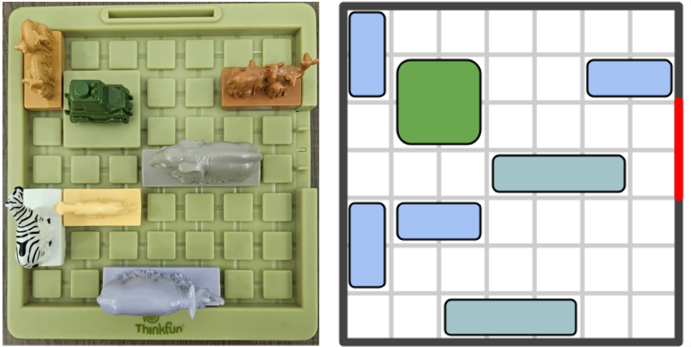
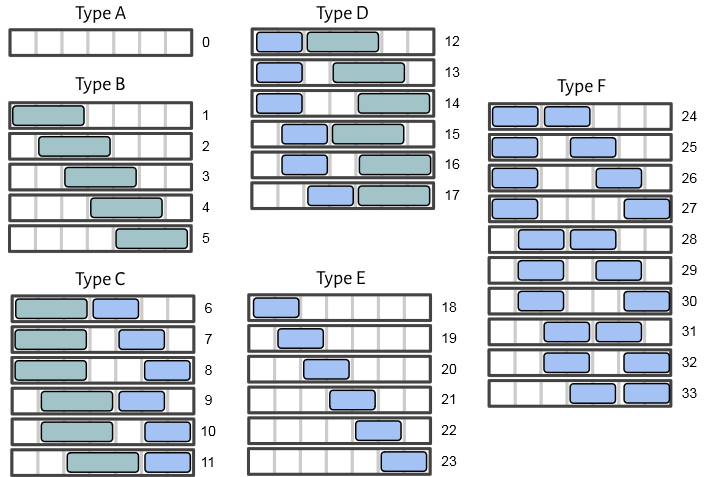

# Safari Rush Hour Cluster Dataset

This repository contains a dataset of clusters for the game Safari Rush Hour (see the image below). Clusters were obtained as integer values obtained from a random uniform distribution as integers, unranked into a set of rows and columns and solved through Iterative Deepening A* with Transposition Tables (IDA*+TT) or Retrograde Analysis.

    

The left is an example board in the physical version of the game, right is a graphical abstraction.

## Contents

+ **idastar_seed_11111.csv** - A list of 56,541 clusters, solved by iterating through all of their boards and running IDA*+TT on each.
+ **idastar_seed_22222.csv** - A list of 34,527 clusters, solved by iterating through all of their boards and running IDA*+TT on each.
+ **retrograde_seed_11111.csv** - A list of 162,324 clusters, solved through Retrograde Analysis.
+ **retrograde_seed_22222.csv** - A list of 169,228 clusters, solved through Retrograde Analysis.

## Dataset Information

Clusters were obtained randomly as integer values from an uniform distribution.

There are in total 331,552 distinct clusters in this dataset, obtained through random search. 
321,428 of the clusters in this dataset exceed the number of pieces in the physical version of the game or cannot be physically constructed due to overlapping pieces, marked as illegal. 
2,608 of the clusters in this dataset do not have at least one board within it that has a solution.
7,516 of the clusters in this dataset were legal and has at least one board with in that has a solution.

## Column description

The data comes in .csv format with the character **;** being used as the delimitator. The files contain six columns of information, explained below.

### Cluster

The cluster column has the cluster identifier. It consists of two parts, a *hexadecimal number* and a *decimal digit*, separated by the character **_**. 

The hexadecimal number corresponds to the distribution of pieces along the rows and columns. The unranked form can be obtained by converting the number from hexadecimal to a base-6 number, and taking the 14 resultant digits (fill with 0 to the left). Each digit corresponds a type of distribution of pieces along a row or column, as shown in the figure below. 

The first 7 digits correspond to the configuration of the columns and the remaining 7 to the configuration of the rows. The configuration is read from **right to left** (for columns) and **bottom to top** (for rows).

    

Note that to see them as columns, rotate them by 90&deg;

The decimal digit corresponds to the number of 2x2 pieces that are **not** the rover present in the boards within the cluster (0: only the rover, 1: one 2x2 piece, 2: two 2x2 pieces).

#### Example

1. The cluster identifier **0xe95d494f8_0** is separated into $e95d494f8_{16}$ and 0.
2. The decimal digit **0** indicates that only the rover is present in the boards within the cluster.
3. For the hexadecimal number, it is converted to a base-6 number $e95d494f8_{16}$ = $62,643,279,096_{10}$ = $44440010513000_{6}$
4. Each of the digits in base-6 can be used to identify a row and column by associating it to a respective type: $44440010513000_{6}$ &rarr; [4, 4, 4, 4, 0, 0, 1, 0, 5, 1, 3, 0, 0, 0] 
5. The result is that **0xe95d494f8_0** identifies all boards with 0 2x2 pieces and the piece configuration [E, E, E, E, A, A, B, A, F, B, D, A, A, A], meaning that the columns have the form [E, E, E, E, A, A, B] and the rows have the form [A, F, B, D, A, A, A]

### Legal

Binary variable describing if a cluster is legal (1) or not (0). A cluster is legal if it meets the following requirements:

1. The pieces on the boards described by its cluster identifier does not exceed the ones present in the physical version of the game (A maximum of 11 pieces of size 2x1, 5 of size 3x1 and 3 of size 2x2, including the rover).
2. At least one board within the cluster has pieces that do not overlap.

### Has Solution

Binary variable describing if a cluster has a solution (1) or not (0). A cluster has a solution if at least one board within the cluster is a solution (the piece rover is on the exit).

### Cluster Size

Integer variable describing the number of legal boards within the cluster. Illegal clusters have a size of 0.

### Max Length

Integer variable describing the solution length from the board within the cluster that has the longest length. This value is obtained by running either IDA*+TT or Retrograde Analysis. Illegals and clusters without solution are marked with a Max Length of -1.

### Time

Floating value describing the amount of time (in seconds) used by the respective algorithm on this cluster.

### AccumulatedTime

Floating value describing the accumulated amount of time (in seconds) used by the respective algorithm up to the respective cluster.